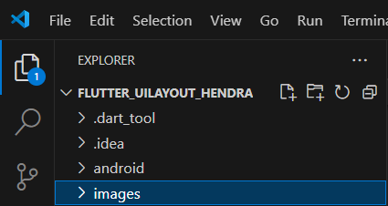

1. Mengganti konten lib/main.dart dengan kode berikut. Aplikasi ini menggunakan parameter untuk judul aplikasi.

2. Menambahkan TitleSection Widget.

3. Mengubah badan aplikasi ke tampilan bergulir. Di bodyproperti, ganti Centerwidget dengan SingleChildScrollViewwidget. Di dalam SingleChildScrollViewwidget, ganti Textwidget dengan Columnwidget.

4. Tambahkan TitleSection Widget sebagai elemen pertama dalam children daftar. Ini akan menempatkannya di bagian atas layar, Memberi nama dan lokasi yang diberikan ke TitleSection konstruktor.

5. Menambahkan kode berikut ke dalam ButtonSectionwidget.

6. Memperbarui aplikasi untuk menampilkan bagian tombol, Menambahkan bagian tombol ke children  daftar.

7. Menambahkan TextSection Widget, dan Menambahkan kode berikut sebagai widget terpisah setelah ButtonSection Widget.

8. Menambahkan widget baru TextSection sebagai anak setelah ButtonSection. Saat menambahkan TextSection Widget, tetapkan deskripsi propertinya ke teks deskripsi lokasi.

9. Membuat images direktori di bagian atas proyek.

10. Unduh gambar dan tambahkan ke images direktori baru.

11. Menambahkan assets tag ke pubspec.yaml file di direktori akar aplikasi kita. Saat kita menambahkan assets, tag tersebut berfungsi sebagai kumpulan petunjuk ke gambar yang tersedia untuk kode kita.

12. Membuat ImageSection Widget

13. Menambahkan ImageSection Widget sebagai anak pertama dalam children daftar, Tetapkan image properti ke jalur gambar yang kita tambahkan di Konfigurasikan aplikasi kita untuk menggunakan gambar yang disediakan.

14. Akhirnya kitas sudah Selesai. Saat kita melakukan hot reload aplikasi, tampilan aplikasi kita akan menjadi seperti berikut ini.

15. Ini adalah semua kode dari pertama sampai yang terakhir

